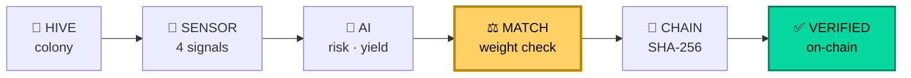
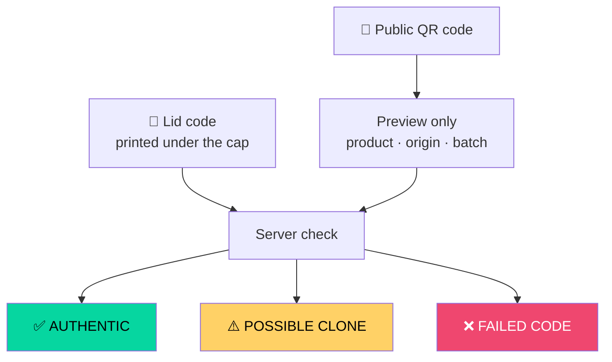

<div align="center">

# 🍯 HiveTrust

### Honey traceability that checks whether the record *could* be true

**Smart India Hackathon 2026** · Problem Statement **SIH26021** · Ministry of MSME
*Honey Chain: A blockchain-based system for honey traceability and smart beekeeping management*

<br>


</div>

---

## The problem

> In December 2020, the Centre for Science and Environment tested honey
> from India's leading brands. **10 of 13 failed** laboratory purity
> testing for sugar syrup.
>
> CSE then spiked pure honey with **50% sugar syrup** and submitted it
> for the tests India mandates. **It passed.**

The syrups now used are made from C3 plants such as rice and beet, whose
carbon-isotope signature closely matches natural honey — engineered
specifically to slip past the test. NMR spectroscopy catches them, and
has been mandatory for honey exported to the US since August 2020, but
is **not required for honey sold inside India**.

Syrup costs about ₹60/kg. Raw honey costs about ₹120/kg. The incentive
is obvious and the test is losing.

## The idea

**We stopped trying to test the product, and started verifying the event.**

Honey is a physical good:

- What leaves a hive must equal **the weight that hive loses**
- A jar cannot contain more honey than was **harvested into it**

Add syrup anywhere in that chain and mass appears from nowhere. That is
detectable with arithmetic — no laboratory, and no test for an adversary
to engineer around.



The highlighted step is the one other traceability platforms do not have.

---

## What makes it different

| | Madhukranti | Trace platforms | **HiveTrust** |
|---|:---:|:---:|:---:|
| Registers supplier and origin | ✅ | ✅ | ✅ |
| Traces the batch | ✅ | ✅ | ✅ |
| Identifies the individual jar | ❌ | ❌ | ✅ |
| Survives a photocopied label | ❌ | ❌ | ✅ |
| **Cross-checks harvest against hive weight** | ❌ | ➖ | ✅ |
| Public receipt anyone can pull | ➖ | ❌ | ✅ |

> *"A QR code alone cannot establish authenticity — codes can be
> regenerated onto counterfeit packaging, and hive sensors are open to
> manipulation."*
> — Fujairah Honey Chain, *Information* 16(8):626, MDPI 2025

We agree. That is exactly why there are three layers:

| Layer | Answers |
|---|---|
| 🔑 **Lid code** | the copied label |
| ⚖️ **Weight match** | the faked sensor reading |
| ⛓️ **Public receipt** | the quietly edited record |

---

## The Harvest Integrity Engine

The core of the system. It reconciles three **independently sourced**
numbers:

| Source | Number | Who produces it |
|---|---|---|
| Hive scale | weight drop | a device |
| Extraction | honey extracted | measured at extraction |
| Operator | weight recorded | the person being audited |

When they disagree beyond sensor tolerance, the record is flagged with
the specific reason:

```
❌ MISMATCH
   6.00 kg more honey was recorded than extracted
   — unaccounted honey entering the batch
```

**Rules applied:**

- recorded **>** extracted → unaccounted honey entering the batch
- recorded **<** extracted → possible diversion before weighing
- extracted **>** hive weight drop → honey from an unrecorded source
- large extraction shortfall → unaccounted loss
- hive **gained** weight during extraction → physically impossible
- moisture **> 20%** → unripe or watered honey

**Cross-record checks** look across many records at once, where the
harder fraud lives. A single harvest can be made internally consistent
by anyone willing to write three numbers that agree. A whole season of
records that *also* agree with the number of hives on the ground is far
harder to fabricate.

- **Unaccounted origin** — everything batched from a hive vs everything
  ever harvested from it
- **Capacity exceeded** — seasonal total vs plausible per-hive output
- **Repeat offender** — distinguishes a pattern from a recording error

> Every verdict is computed **server-side**. The operator being audited
> cannot author their own result.

---

## Two credentials per jar



The QR is public and safe to print — it gives away nothing a
counterfeiter could use. The second code is **never in the link**. So a
photocopied label yields a preview and a clone warning; only physical
possession of the sealed jar unlocks the full report.

---

## The AI, and how we calibrated it

A Random Forest returns a **risk class**, a **yield range**, and a
**plain-language reason**.

It trains on synthetic data, because no public hive telemetry exists for
Indian conditions or for *Apis cerana indica*. So we validated the
generator against real data — 7,066 *Apis mellifera* readings from an
instrumented apiary ([Zenodo 10.5281/zenodo.20399470](https://zenodo.org/records/20399470), CC-BY-4.0).

**It found two real errors in our model.**

Our temperature range was `18–42 °C`. Real interior temperature sits at
**35.2–38.0 °C, median 36.2, σ 0.4** — colonies thermoregulate the brood
nest tightly. Nearly every training sample was drawn from conditions no
living colony reaches. Interior humidity was similarly wrong: real
median **67.4%** against an assumed ideal of 60%.

| | original | after calibration |
|---|---:|---:|
| Held-out accuracy | 82.75% | **86.00%** |
| Healthy real colonies scored low-risk | 40.3% | **99.6%** |
| Chilled brood · overheating · dry · wet · idle | detected | **detected** |

A model that flags healthy beekeepers is one beekeepers learn to ignore.
The second row matters more than the first.

Reproduce it yourself:

```bash
python validate_against_real.py realdata/apis_hive2.csv
```

---

## Quick start

```bash
git clone https://github.com/aminul821/hive
cd hive
pip install -r requirements.txt

cp env.example .env          # add DATABASE_URL and HIVETRUST_SECRET_KEY

python smoke_test.py         # 44 tests, uses a throwaway database
python migrate_to_db.py      # create schema, import seed data
python train_model.py        # generate models/*.pkl
python app.py
```

Open **http://127.0.0.1:5000**

With `DATABASE_URL` unset it falls back to local SQLite, so the app runs
with no Supabase account.

> **Supabase note:** use the **Session pooler** string (port 5432), not
> "Direct connection" — the direct host is IPv6-only on the free tier
> and most hosts are IPv4-only. See [`MIGRATION.md`](MIGRATION.md).

---

## API

| Endpoint | Purpose |
|---|---|
| `GET /api/health` | service · database · model status |
| `GET /api/database` | full snapshot (lid codes excluded) |
| `POST /api/batches` · `GET /api/batches/<id>` | batch registry |
| `POST /api/bottles` · `GET /api/bottles/<token>` | bottle registry |
| `GET /api/qr/<token>` | scannable QR PNG |
| `POST /api/verify` | two-factor verification |
| `POST /api/sensor-data` · `GET /api/sensor-data/<id>` | telemetry |
| `POST /api/harvests` · `GET /api/harvests` | harvest records + verdict |
| `POST /api/harvests/evaluate` | dry-run check, nothing saved |
| `GET /api/integrity/audit` | supply-chain-wide audit |
| `POST /api/predict` | RandomForest risk + yield |
| `GET /api/blockchain/status` | on-chain record count |

## Project layout

```
├── app.py                    # Flask factory
├── config.py                 # Supabase connection handling
├── models.py                 # PostgreSQL schema
├── store.py                  # data access layer
├── integrity.py              # ⭐ the Harvest Integrity Engine
├── blockchain.py             # HoneyLedger, web3.py
├── ml_predictor.py           # inference
├── train_model.py            # calibrated synthetic generator
├── validate_against_real.py  # validates against real hive telemetry
├── smoke_test.py             # 44 tests
├── contracts/
│   └── HoneyLedger.sol       # the deployed contract
├── routes/main.py            # API
└── static/js/app.js          # frontend
```

## Stack

| Layer | Technology |
|---|---|
| **Field** | ESP32 · SHT41 · HX711 load cell · IMU · solar + LoRa |
| **API** | Python 3 · Flask 3.1 · 9 services |
| **Data** | PostgreSQL (Supabase) · SQLAlchemy |
| **AI** | scikit-learn · RandomForest classifier + regressor |
| **Trust** | SHA-256 · Solidity · web3.py · Ethereum Sepolia |

---

## Feasibility

India produced **1,51,690 MT** of honey in 2025–26 and ranks **2nd
globally** in export volume. **₹250 crore** is committed under the
National Beekeeping and Honey Mission, and around **100 FPOs** already
aggregate beekeeper output.

| 50-hive cooperative | |
|---|---:|
| Honey produced | 900 kg/yr |
| Before — bulk @ ₹157/kg | ₹1.41 L |
| HiveTrust cost | ₹34,000 |
| After — verified @ ₹257/kg | ₹2.31 L |
| **Net gain** | **₹56,000/yr** |
| **Return per rupee spent** | **1.65×** |

At 1,000 hives the return rises to about **7×**. Running cost for a
100-hive pilot is ~₹2,170/month, of which the ledger is 7% — roughly ₹1
per record.

*The ₹100/kg uplift, 18 kg/hive/year, three-year node life and
one-node-per-five-hives ratio are our own assumptions, not observed
results. No revenue has been earned.*

---

## Honest limitations

Stated plainly, because they are the questions worth asking.

- **Sensors are simulated.** `simulate_sensors.py` posts to the same
  ingest endpoint real hardware would use. No hive is currently
  instrumented.
- **The model trains on synthetic data**, calibrated against real
  telemetry — not on labelled Indian hive data, which is not publicly
  available.
- **The contract is on Sepolia testnet.** Real chain, test currency.
- **Roles are not authenticated** and write endpoints are not
  access-controlled. Both are required before any real deployment.
- **A blockchain proves a record was not altered after anchoring. It
  does not prove the record was true when written.** A beekeeper who
  records a false harvest weight produces a perfectly honest hash of a
  false record. Catching that is the integrity engine's job. The two
  mechanisms solve different halves of the problem and neither replaces
  the other.

---

## References

**Adulteration evidence** — Centre for Science and Environment, NMR study, December 2020
**Sector data** — DA&FW · National Bee Board · PIB · APEDA · NBHM · FSSAI
**Prior art** — Madhukranti Portal · NAFED Honey Corners · TraceX · FoodTraze
**Research** — *Information* 16(8):626, MDPI 2025
**Validation dataset** — [Zenodo 10.5281/zenodo.20399470](https://zenodo.org/records/20399470) (CC-BY-4.0)

Full notes in [`REFERENCES.md`](REFERENCES.md).

---

<div align="center">

**Team HexaDevelopers** · Smart India Hackathon 2026

*Traceability platforms record what was claimed to have happened.*
*HiveTrust tests whether the claim is physically possible.*

</div>
